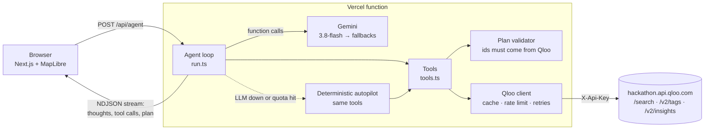

# TasteBridge: move cities, keep your taste

TasteBridge is a relocation agent with taste. You tell it the places you love in your current city: your café, a jazz
club, a cinema, an artist, or a habit like "Sunday flea markets". It then:

1. resolves each favourite in the **Qloo taste graph** (biased to your home city);
2. finds its **taste-equivalent in your new city** ("your Drop Coffee in Lisbon is Copenhagen Coffee Lab, and your Tyge & Sessil is Vino Vero"), with
   the shared taste tags, Qloo affinity and explainability behind each match;
3. ranks the **neighbourhoods that fit you**, using a Qloo affinity heatmap together with where your matches cluster;
4. writes a **first-week plan** that you can step through on a map.

You can watch every step of the agent's reasoning as it works.

**Live demo:** https://tastebridge-teal.vercel.app. It needs no login. Three pre-baked journeys replay instantly, and you
can also build your own.

Built for the [Qloo Agentic Hackathon](https://qloo.devpost.com/) (2026).

## Why

Moving abroad for work or study is lonely. The admin of a move is well served by apps; the cultural side is not. Most
people spend months finding "their" café, bar or venue again. Relocation teams in HR know that slow social integration
is a major reason international assignments fail. TasteBridge treats taste as something you can carry with you: it
starts from what you already love and translates it, place by place, into a new city.

## How Qloo is used

All Qloo calls run server-side through a typed client (`src/lib/qloo/client.ts`). The client sends
`X-Api-Key` to `https://hackathon.api.qloo.com` and includes response caching (6 h LRU), an outbound token-bucket rate
limiter, and bounded retries on 429.

| Agent tool | Qloo endpoint | Purpose |
|---|---|---|
| `search_entities` | `GET /search` with `filter.location=<home city lat,lon>`, plus an unbiased lookup for artists and films | Resolve "Drop Coffee" to the Stockholm roastery, not one of the other Drop Coffees in Turkey, Brazil or Japan |
| `lookup_tags` | `GET /v2/tags` with `filter.parents.types=urn:entity:place` | Turn habits or vibes ("natural wine", "vintage shopping") into place tag ids |
| `find_equivalents` | `GET /v2/insights` with `filter.type=urn:entity:place`, `filter.location.query=<new city>`, `signal.interests.entities=<one favourite>`, `filter.tags=<its primary genre>`, `filter.exclude.tags=<hotels…>`, `feature.explainability=true` | One like-for-like "then → now" match per favourite (wine bar → wine bar), with explainability |
| `find_equivalents` (habit) | `GET /v2/insights` with `filter.tags=<the habit's tags>` and `signal.interests.entities=<the places already resolved>` | Places that carry the habit, ranked by your taste |
| `find_taste_matches` | `GET /v2/insights` (places, all resolved favourites as signals) | Broader picks for the week plan |
| `rank_neighbourhoods` | `GET /v2/insights` with `filter.type=urn:heatmap` | Taste affinity per geohash cell, aggregated into named neighbourhoods |
| `/api/search` (UI) | `GET /search` | Autocomplete for the favourites input |

The final `submit_plan` step is validated on the server. The model can only reference entity ids that Qloo actually
returned, and unknown ids are dropped, so the agent cannot invent venues. Shared tags are computed from Qloo tags (with
logistics tags such as payments or wheelchair access filtered out), not written by the model. Each favourite gets a
different target place. Matches below 50% affinity are labelled as weak signals.

Qloo results are aggregate affinities and say nothing about any individual. TasteBridge sends Qloo only public cultural
entities and city names, never personal data.

### What we learned from the live API

- `/search` is global, so a name like "Drop Coffee" returns cafés on four continents. Passing `filter.location` with the
  home city's centre fixes this. That filter only returns places, so a second, unbiased call keeps artists reachable.
- `/v2/insights` with `filter.location.query` can include nearby towns (Cascais for Lisbon, Mississauga for Toronto).
  We over-fetch and keep places within 11 km of the centre. `filter.location.radius` had no effect in our tests.
- Seeding insights with tag signals alone (`signal.interests.tags`) was slow (~15 s) and noisy for places. Filtering by
  tags while ranking with entity signals was fast (<1 s) and precise.
- Hotels dominate many whole-profile results, so `filter.exclude.tags` removes lodging and similar genres.

## Architecture



- **Streaming reasoning:** the UI renders each agent step as it happens.
- **LLM resilience:** free-tier Gemini quotas are small and per model, so on a 429 or 5xx the agent moves down a chain
  of models (`GEMINI_FALLBACKS`). If all are used up, the deterministic autopilot finishes the same job with the same
  Qloo tools, and the trail says so.
- **Demo journeys:** recorded live agent runs (`public/journeys/*.json`, made with `npm run bake`) replay instantly.
- **Abuse protection:** per-IP limit on agent runs, plus the Qloo cache (6 h LRU) and outbound rate limiter.
- **Mock mode:** when `QLOO_API_KEY` is not set, the client serves offline fixtures shaped like Qloo responses
  (`src/lib/qloo/mock.ts`), so the project runs for anyone without a key. The deployed site uses the live API.
- **Tests:** `tests/live-shapes.test.ts` checks the parsers against trimmed real responses recorded from the hackathon
  API; the other tests cover the agent and the mock client.

## Run locally

```bash
npm install
cp .env.example .env.local   # add QLOO_API_KEY and GEMINI_API_KEY (both optional)
npm run dev                  # http://localhost:3000
npm test                     # vitest: Qloo client + agent
```

Requires Node 20+.

## Limitations

- Qloo place coverage is excellent for venues (cafés, bars, museums, cinemas, clubs). Artists as favourites translate
  less well into places, so the agent maps them to music and culture venues and shows weaker scores honestly.
- Some genre-filtered results (for example markets) come back without an affinity score. The card says so.
- Neighbourhood centroids are hand-picked per city (Lisbon, Berlin, Toronto, Amsterdam, Barcelona, London, New York,
  Copenhagen), and heatmap cells are assigned to the nearest one.
- The hosted demo uses free-tier Gemini, so on busy days live runs may be planned by the autopilot instead of the LLM.
- An affinity score is a statistical association across many people. It is not a promise that you will love a place.

## Credits and disclosure

Built by Teddy Wasserman with substantial assistance from **Claude Code** (Anthropic's AI coding agent), which wrote
much of the code under my direction. Taste data comes from the [Qloo](https://qloo.com) Taste AI API. The agent runs on
Google Gemini. Map tiles © OpenStreetMap contributors, © CARTO.

MIT licensed. See [LICENSE](LICENSE).
